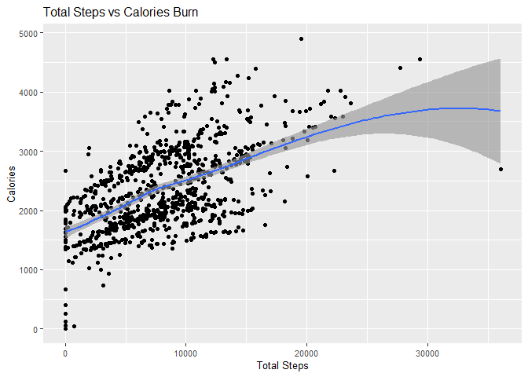
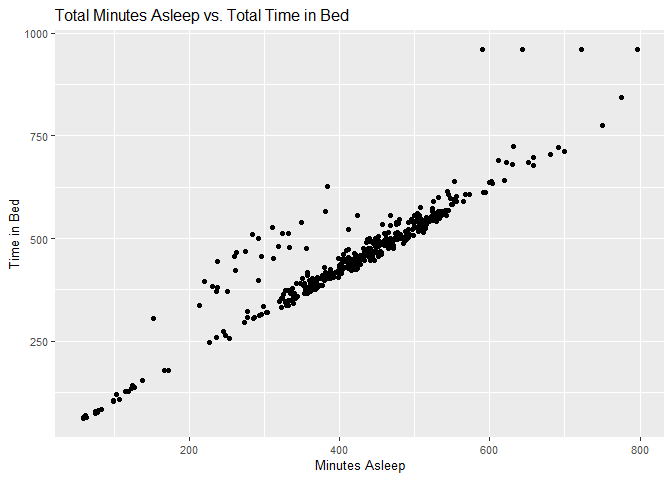
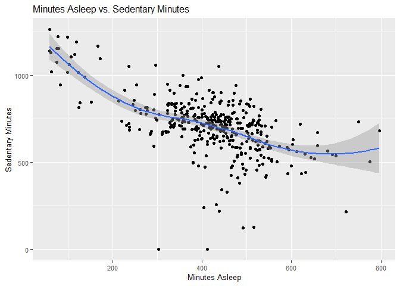
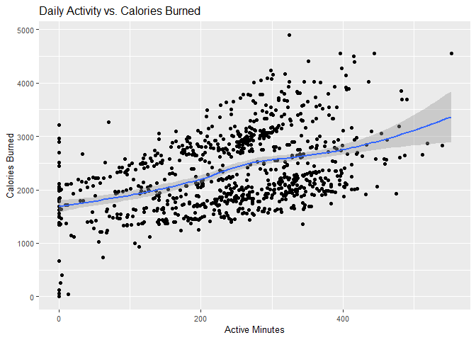

Bellabeat is a high tech company that manufactures health-focused smart
products for women. Since launching in 2013 they have grown rapidly and
quickly positioned themselves to become a large player in global smart
devices. Urška Sršen, Co-founder and Chief Creative Officer of Bellabeat
wants an analyst on the data that is received from other smart devices
to help unlock new growth opportunities for the company.

### **Questins for the Analyst**

1.  What are some trends in smart device usage?
2.  How could these trends apply to Bellabeat customers?
3.  How could these trends help influence Bellabeat marketing strategy

### **Business Task**

To identify growth opportunities for Bellabeat to improves marketing
strategies to keep up with trends in smart device usage.

### **Loading Packages**

    library(tidyverse)

    ## ── Attaching core tidyverse packages ──────────────────────── tidyverse 2.0.0 ──
    ## ✔ dplyr     1.1.4     ✔ readr     2.1.5
    ## ✔ forcats   1.0.0     ✔ stringr   1.5.1
    ## ✔ ggplot2   3.5.0     ✔ tibble    3.2.1
    ## ✔ lubridate 1.9.3     ✔ tidyr     1.3.1
    ## ✔ purrr     1.0.2     
    ## ── Conflicts ────────────────────────────────────────── tidyverse_conflicts() ──
    ## ✖ dplyr::filter() masks stats::filter()
    ## ✖ dplyr::lag()    masks stats::lag()
    ## ℹ Use the conflicted package (<http://conflicted.r-lib.org/>) to force all conflicts to become errors

    library(dplyr)
    library(ggplot2)

### **Importing Files**

For this case study I will be using the data provided by [FitBit Fitness
Tracker](https://www.kaggle.com/datasets/arashnic/fitbit)

    activity <- read_csv("C:/Users/crazz/Desktop/Fitabase Data 4.12.16-5.12.16/dailyActivity_merged.csv")

    ## Rows: 940 Columns: 15
    ## ── Column specification ────────────────────────────────────────────────────────
    ## Delimiter: ","
    ## chr  (1): ActivityDate
    ## dbl (14): Id, TotalSteps, TotalDistance, TrackerDistance, LoggedActivitiesDi...
    ## 
    ## ℹ Use `spec()` to retrieve the full column specification for this data.
    ## ℹ Specify the column types or set `show_col_types = FALSE` to quiet this message.

    calories <- read_csv("C:/Users/crazz/Desktop/Fitabase Data 4.12.16-5.12.16/dailyCalories_merged.csv")

    ## Rows: 940 Columns: 3
    ## ── Column specification ────────────────────────────────────────────────────────
    ## Delimiter: ","
    ## chr (1): ActivityDay
    ## dbl (2): Id, Calories
    ## 
    ## ℹ Use `spec()` to retrieve the full column specification for this data.
    ## ℹ Specify the column types or set `show_col_types = FALSE` to quiet this message.

    intensities <- read.csv("C:/Users/crazz/Desktop/Fitabase Data 4.12.16-5.12.16/hourlyIntensities_merged.csv")
    sleep <- read_csv("C:/Users/crazz/Desktop/Fitabase Data 4.12.16-5.12.16/sleepDay_merged.csv")

    ## Rows: 413 Columns: 5
    ## ── Column specification ────────────────────────────────────────────────────────
    ## Delimiter: ","
    ## chr (1): SleepDay
    ## dbl (4): Id, TotalSleepRecords, TotalMinutesAsleep, TotalTimeInBed
    ## 
    ## ℹ Use `spec()` to retrieve the full column specification for this data.
    ## ℹ Specify the column types or set `show_col_types = FALSE` to quiet this message.

    weight <- read_csv("C:/Users/crazz/Desktop/Fitabase Data 4.12.16-5.12.16/weightLogInfo_merged.csv")

    ## Rows: 67 Columns: 8
    ## ── Column specification ────────────────────────────────────────────────────────
    ## Delimiter: ","
    ## chr (1): Date
    ## dbl (6): Id, WeightKg, WeightPounds, Fat, BMI, LogId
    ## lgl (1): IsManualReport
    ## 
    ## ℹ Use `spec()` to retrieve the full column specification for this data.
    ## ℹ Specify the column types or set `show_col_types = FALSE` to quiet this message.

    steps <- read_csv("C:/Users/crazz/Desktop/Fitabase Data 4.12.16-5.12.16/hourlySteps_merged.csv")

    ## Rows: 22099 Columns: 3
    ## ── Column specification ────────────────────────────────────────────────────────
    ## Delimiter: ","
    ## chr (1): ActivityHour
    ## dbl (2): Id, StepTotal
    ## 
    ## ℹ Use `spec()` to retrieve the full column specification for this data.
    ## ℹ Specify the column types or set `show_col_types = FALSE` to quiet this message.

### **Exploring the data**

    head(activity)

    ## # A tibble: 6 × 15
    ##           Id ActivityDate TotalSteps TotalDistance TrackerDistance
    ##        <dbl> <chr>             <dbl>         <dbl>           <dbl>
    ## 1 1503960366 4/12/2016         13162          8.5             8.5 
    ## 2 1503960366 4/13/2016         10735          6.97            6.97
    ## 3 1503960366 4/14/2016         10460          6.74            6.74
    ## 4 1503960366 4/15/2016          9762          6.28            6.28
    ## 5 1503960366 4/16/2016         12669          8.16            8.16
    ## 6 1503960366 4/17/2016          9705          6.48            6.48
    ## # ℹ 10 more variables: LoggedActivitiesDistance <dbl>,
    ## #   VeryActiveDistance <dbl>, ModeratelyActiveDistance <dbl>,
    ## #   LightActiveDistance <dbl>, SedentaryActiveDistance <dbl>,
    ## #   VeryActiveMinutes <dbl>, FairlyActiveMinutes <dbl>,
    ## #   LightlyActiveMinutes <dbl>, SedentaryMinutes <dbl>, Calories <dbl>

    head(calories)

    ## # A tibble: 6 × 3
    ##           Id ActivityDay Calories
    ##        <dbl> <chr>          <dbl>
    ## 1 1503960366 4/12/2016       1985
    ## 2 1503960366 4/13/2016       1797
    ## 3 1503960366 4/14/2016       1776
    ## 4 1503960366 4/15/2016       1745
    ## 5 1503960366 4/16/2016       1863
    ## 6 1503960366 4/17/2016       1728

    head(sleep)

    ## # A tibble: 6 × 5
    ##           Id SleepDay        TotalSleepRecords TotalMinutesAsleep TotalTimeInBed
    ##        <dbl> <chr>                       <dbl>              <dbl>          <dbl>
    ## 1 1503960366 4/12/2016 12:0…                 1                327            346
    ## 2 1503960366 4/13/2016 12:0…                 2                384            407
    ## 3 1503960366 4/15/2016 12:0…                 1                412            442
    ## 4 1503960366 4/16/2016 12:0…                 2                340            367
    ## 5 1503960366 4/17/2016 12:0…                 1                700            712
    ## 6 1503960366 4/19/2016 12:0…                 1                304            320

    head(intensities)

    ##           Id          ActivityHour TotalIntensity AverageIntensity
    ## 1 1503960366 4/12/2016 12:00:00 AM             20         0.333333
    ## 2 1503960366  4/12/2016 1:00:00 AM              8         0.133333
    ## 3 1503960366  4/12/2016 2:00:00 AM              7         0.116667
    ## 4 1503960366  4/12/2016 3:00:00 AM              0         0.000000
    ## 5 1503960366  4/12/2016 4:00:00 AM              0         0.000000
    ## 6 1503960366  4/12/2016 5:00:00 AM              0         0.000000

    head(steps)

    ## # A tibble: 6 × 3
    ##           Id ActivityHour          StepTotal
    ##        <dbl> <chr>                     <dbl>
    ## 1 1503960366 4/12/2016 12:00:00 AM       373
    ## 2 1503960366 4/12/2016 1:00:00 AM        160
    ## 3 1503960366 4/12/2016 2:00:00 AM        151
    ## 4 1503960366 4/12/2016 3:00:00 AM          0
    ## 5 1503960366 4/12/2016 4:00:00 AM          0
    ## 6 1503960366 4/12/2016 5:00:00 AM          0

### **Fixing Format**

I went through the data sets and realized the dates were inconsistent,
some were written as chr format and not date format. I went through and
converted all the dates to be the same and split the date and time in
the sleep clart.

    str(activity)

    ## spc_tbl_ [940 × 15] (S3: spec_tbl_df/tbl_df/tbl/data.frame)
    ##  $ Id                      : num [1:940] 1.5e+09 1.5e+09 1.5e+09 1.5e+09 1.5e+09 ...
    ##  $ ActivityDate            : chr [1:940] "4/12/2016" "4/13/2016" "4/14/2016" "4/15/2016" ...
    ##  $ TotalSteps              : num [1:940] 13162 10735 10460 9762 12669 ...
    ##  $ TotalDistance           : num [1:940] 8.5 6.97 6.74 6.28 8.16 ...
    ##  $ TrackerDistance         : num [1:940] 8.5 6.97 6.74 6.28 8.16 ...
    ##  $ LoggedActivitiesDistance: num [1:940] 0 0 0 0 0 0 0 0 0 0 ...
    ##  $ VeryActiveDistance      : num [1:940] 1.88 1.57 2.44 2.14 2.71 ...
    ##  $ ModeratelyActiveDistance: num [1:940] 0.55 0.69 0.4 1.26 0.41 ...
    ##  $ LightActiveDistance     : num [1:940] 6.06 4.71 3.91 2.83 5.04 ...
    ##  $ SedentaryActiveDistance : num [1:940] 0 0 0 0 0 0 0 0 0 0 ...
    ##  $ VeryActiveMinutes       : num [1:940] 25 21 30 29 36 38 42 50 28 19 ...
    ##  $ FairlyActiveMinutes     : num [1:940] 13 19 11 34 10 20 16 31 12 8 ...
    ##  $ LightlyActiveMinutes    : num [1:940] 328 217 181 209 221 164 233 264 205 211 ...
    ##  $ SedentaryMinutes        : num [1:940] 728 776 1218 726 773 ...
    ##  $ Calories                : num [1:940] 1985 1797 1776 1745 1863 ...
    ##  - attr(*, "spec")=
    ##   .. cols(
    ##   ..   Id = col_double(),
    ##   ..   ActivityDate = col_character(),
    ##   ..   TotalSteps = col_double(),
    ##   ..   TotalDistance = col_double(),
    ##   ..   TrackerDistance = col_double(),
    ##   ..   LoggedActivitiesDistance = col_double(),
    ##   ..   VeryActiveDistance = col_double(),
    ##   ..   ModeratelyActiveDistance = col_double(),
    ##   ..   LightActiveDistance = col_double(),
    ##   ..   SedentaryActiveDistance = col_double(),
    ##   ..   VeryActiveMinutes = col_double(),
    ##   ..   FairlyActiveMinutes = col_double(),
    ##   ..   LightlyActiveMinutes = col_double(),
    ##   ..   SedentaryMinutes = col_double(),
    ##   ..   Calories = col_double()
    ##   .. )
    ##  - attr(*, "problems")=<externalptr>

    str(calories)

    ## spc_tbl_ [940 × 3] (S3: spec_tbl_df/tbl_df/tbl/data.frame)
    ##  $ Id         : num [1:940] 1.5e+09 1.5e+09 1.5e+09 1.5e+09 1.5e+09 ...
    ##  $ ActivityDay: chr [1:940] "4/12/2016" "4/13/2016" "4/14/2016" "4/15/2016" ...
    ##  $ Calories   : num [1:940] 1985 1797 1776 1745 1863 ...
    ##  - attr(*, "spec")=
    ##   .. cols(
    ##   ..   Id = col_double(),
    ##   ..   ActivityDay = col_character(),
    ##   ..   Calories = col_double()
    ##   .. )
    ##  - attr(*, "problems")=<externalptr>

    str(calories)

    ## spc_tbl_ [940 × 3] (S3: spec_tbl_df/tbl_df/tbl/data.frame)
    ##  $ Id         : num [1:940] 1.5e+09 1.5e+09 1.5e+09 1.5e+09 1.5e+09 ...
    ##  $ ActivityDay: chr [1:940] "4/12/2016" "4/13/2016" "4/14/2016" "4/15/2016" ...
    ##  $ Calories   : num [1:940] 1985 1797 1776 1745 1863 ...
    ##  - attr(*, "spec")=
    ##   .. cols(
    ##   ..   Id = col_double(),
    ##   ..   ActivityDay = col_character(),
    ##   ..   Calories = col_double()
    ##   .. )
    ##  - attr(*, "problems")=<externalptr>

    str(intensities)

    ## 'data.frame':    22099 obs. of  4 variables:
    ##  $ Id              : num  1.5e+09 1.5e+09 1.5e+09 1.5e+09 1.5e+09 ...
    ##  $ ActivityHour    : chr  "4/12/2016 12:00:00 AM" "4/12/2016 1:00:00 AM" "4/12/2016 2:00:00 AM" "4/12/2016 3:00:00 AM" ...
    ##  $ TotalIntensity  : int  20 8 7 0 0 0 0 0 13 30 ...
    ##  $ AverageIntensity: num  0.333 0.133 0.117 0 0 ...

    str(sleep)

    ## spc_tbl_ [413 × 5] (S3: spec_tbl_df/tbl_df/tbl/data.frame)
    ##  $ Id                : num [1:413] 1.5e+09 1.5e+09 1.5e+09 1.5e+09 1.5e+09 ...
    ##  $ SleepDay          : chr [1:413] "4/12/2016 12:00:00 AM" "4/13/2016 12:00:00 AM" "4/15/2016 12:00:00 AM" "4/16/2016 12:00:00 AM" ...
    ##  $ TotalSleepRecords : num [1:413] 1 2 1 2 1 1 1 1 1 1 ...
    ##  $ TotalMinutesAsleep: num [1:413] 327 384 412 340 700 304 360 325 361 430 ...
    ##  $ TotalTimeInBed    : num [1:413] 346 407 442 367 712 320 377 364 384 449 ...
    ##  - attr(*, "spec")=
    ##   .. cols(
    ##   ..   Id = col_double(),
    ##   ..   SleepDay = col_character(),
    ##   ..   TotalSleepRecords = col_double(),
    ##   ..   TotalMinutesAsleep = col_double(),
    ##   ..   TotalTimeInBed = col_double()
    ##   .. )
    ##  - attr(*, "problems")=<externalptr>

    str(weight)

    ## spc_tbl_ [67 × 8] (S3: spec_tbl_df/tbl_df/tbl/data.frame)
    ##  $ Id            : num [1:67] 1.50e+09 1.50e+09 1.93e+09 2.87e+09 2.87e+09 ...
    ##  $ Date          : chr [1:67] "5/2/2016 11:59:59 PM" "5/3/2016 11:59:59 PM" "4/13/2016 1:08:52 AM" "4/21/2016 11:59:59 PM" ...
    ##  $ WeightKg      : num [1:67] 52.6 52.6 133.5 56.7 57.3 ...
    ##  $ WeightPounds  : num [1:67] 116 116 294 125 126 ...
    ##  $ Fat           : num [1:67] 22 NA NA NA NA 25 NA NA NA NA ...
    ##  $ BMI           : num [1:67] 22.6 22.6 47.5 21.5 21.7 ...
    ##  $ IsManualReport: logi [1:67] TRUE TRUE FALSE TRUE TRUE TRUE ...
    ##  $ LogId         : num [1:67] 1.46e+12 1.46e+12 1.46e+12 1.46e+12 1.46e+12 ...
    ##  - attr(*, "spec")=
    ##   .. cols(
    ##   ..   Id = col_double(),
    ##   ..   Date = col_character(),
    ##   ..   WeightKg = col_double(),
    ##   ..   WeightPounds = col_double(),
    ##   ..   Fat = col_double(),
    ##   ..   BMI = col_double(),
    ##   ..   IsManualReport = col_logical(),
    ##   ..   LogId = col_double()
    ##   .. )
    ##  - attr(*, "problems")=<externalptr>

    str(steps)

    ## spc_tbl_ [22,099 × 3] (S3: spec_tbl_df/tbl_df/tbl/data.frame)
    ##  $ Id          : num [1:22099] 1.5e+09 1.5e+09 1.5e+09 1.5e+09 1.5e+09 ...
    ##  $ ActivityHour: chr [1:22099] "4/12/2016 12:00:00 AM" "4/12/2016 1:00:00 AM" "4/12/2016 2:00:00 AM" "4/12/2016 3:00:00 AM" ...
    ##  $ StepTotal   : num [1:22099] 373 160 151 0 0 ...
    ##  - attr(*, "spec")=
    ##   .. cols(
    ##   ..   Id = col_double(),
    ##   ..   ActivityHour = col_character(),
    ##   ..   StepTotal = col_double()
    ##   .. )
    ##  - attr(*, "problems")=<externalptr>

    #activity
    activity_cleaned <- activity %>% 
      rename(Date = ActivityDate) %>% 
      mutate(Date = as.Date(Date, format = "%m/%d/%y")) %>%
      rename_with(tolower)

    #calories
    calories_cleaned <- calories %>% 
      rename(Date = ActivityDay) %>% 
      mutate(Date = as.Date(Date, format = "%m/%d/%y"))%>%
      rename_with(tolower)

    #sleep
    sleep_cleaned <- sleep %>% 
      rename(Date = SleepDay) %>% 
      mutate(Date = as.Date(Date, format = "%m/%d/%y"))%>%
      rename_with(tolower)

    #steps
    steps_cleaned <-steps %>%
      rename(Date = ActivityHour) %>% 
      mutate(Date = as.Date(Date, format = "%m/%d/%y"))%>%
      rename_with(tolower)
    steps$time <- format(steps$ActivityHour, format = "%H:%M:%S")
    steps$date <- format(steps$ActivityHour, format = "%m/%d/%y")

### **Exploring and Summarizing Data**

    n_distinct(activity$Id)

    ## [1] 33

    n_distinct(calories$Id)

    ## [1] 33

    n_distinct(intensities$Id)

    ## [1] 33

    n_distinct(sleep$Id)

    ## [1] 24

    n_distinct(weight$Id)

    ## [1] 8

    n_distinct(steps$Id)

    ## [1] 33

Running this code allows us to get a number of how many participate IDs
are recorded in each data set.

33 participants were record for activity, calories, steps, and
intensities.

24 participants recorded their sleep records.

Only 8 participants recorded their weight.

    # activity
    activity %>%  
      select(TotalSteps,
             TotalDistance,
             SedentaryMinutes, Calories) %>%
      summary()

    ##    TotalSteps    TotalDistance    SedentaryMinutes    Calories   
    ##  Min.   :    0   Min.   : 0.000   Min.   :   0.0   Min.   :   0  
    ##  1st Qu.: 3790   1st Qu.: 2.620   1st Qu.: 729.8   1st Qu.:1828  
    ##  Median : 7406   Median : 5.245   Median :1057.5   Median :2134  
    ##  Mean   : 7638   Mean   : 5.490   Mean   : 991.2   Mean   :2304  
    ##  3rd Qu.:10727   3rd Qu.: 7.713   3rd Qu.:1229.5   3rd Qu.:2793  
    ##  Max.   :36019   Max.   :28.030   Max.   :1440.0   Max.   :4900

    # explore num of active minutes per category
    activity %>%
      select(VeryActiveMinutes, FairlyActiveMinutes, LightlyActiveMinutes) %>%
      summary()

    ##  VeryActiveMinutes FairlyActiveMinutes LightlyActiveMinutes
    ##  Min.   :  0.00    Min.   :  0.00      Min.   :  0.0       
    ##  1st Qu.:  0.00    1st Qu.:  0.00      1st Qu.:127.0       
    ##  Median :  4.00    Median :  6.00      Median :199.0       
    ##  Mean   : 21.16    Mean   : 13.56      Mean   :192.8       
    ##  3rd Qu.: 32.00    3rd Qu.: 19.00      3rd Qu.:264.0       
    ##  Max.   :210.00    Max.   :143.00      Max.   :518.0

    # calories
    calories %>%
      select(Calories) %>%
      summary()

    ##     Calories   
    ##  Min.   :   0  
    ##  1st Qu.:1828  
    ##  Median :2134  
    ##  Mean   :2304  
    ##  3rd Qu.:2793  
    ##  Max.   :4900

    # sleep
    sleep %>%
      select(TotalSleepRecords, TotalMinutesAsleep, TotalTimeInBed) %>%
      summary()

    ##  TotalSleepRecords TotalMinutesAsleep TotalTimeInBed 
    ##  Min.   :1.000     Min.   : 58.0      Min.   : 61.0  
    ##  1st Qu.:1.000     1st Qu.:361.0      1st Qu.:403.0  
    ##  Median :1.000     Median :433.0      Median :463.0  
    ##  Mean   :1.119     Mean   :419.5      Mean   :458.6  
    ##  3rd Qu.:1.000     3rd Qu.:490.0      3rd Qu.:526.0  
    ##  Max.   :3.000     Max.   :796.0      Max.   :961.0

    # weight
    weight %>%
      select(WeightKg, BMI) %>%
      summary()

    ##     WeightKg           BMI       
    ##  Min.   : 52.60   Min.   :21.45  
    ##  1st Qu.: 61.40   1st Qu.:23.96  
    ##  Median : 62.50   Median :24.39  
    ##  Mean   : 72.04   Mean   :25.19  
    ##  3rd Qu.: 85.05   3rd Qu.:25.56  
    ##  Max.   :133.50   Max.   :47.54

Most participants do little moving, averaging around 16 hours, and are
lightly active.

The average amount of sleep everyone gets in a night is about 7 hours.

The average amount of steps a person per day is 7,638 steps which is a
little below the average goal of 8,000 per day.

### **Merging Data for Further Analysist**

I decided to merge the sleep and activity tables together as they go
hand in hand. If you do not get a good amount of sleep it hinders how
much activity you want to do during the next day. The relationship
between sedentary minutes and steps taken are a very imprtant key.

    activity_sleep <- merge(sleep_cleaned, activity_cleaned, by=c("id", "date"))

    head(activity_sleep)

    ##           id       date totalsleeprecords totalminutesasleep totaltimeinbed
    ## 1 1503960366 2020-04-12                 1                327            346
    ## 2 1503960366 2020-04-13                 2                384            407
    ## 3 1503960366 2020-04-15                 1                412            442
    ## 4 1503960366 2020-04-16                 2                340            367
    ## 5 1503960366 2020-04-17                 1                700            712
    ## 6 1503960366 2020-04-19                 1                304            320
    ##   totalsteps totaldistance trackerdistance loggedactivitiesdistance
    ## 1      13162          8.50            8.50                        0
    ## 2      10735          6.97            6.97                        0
    ## 3       9762          6.28            6.28                        0
    ## 4      12669          8.16            8.16                        0
    ## 5       9705          6.48            6.48                        0
    ## 6      15506          9.88            9.88                        0
    ##   veryactivedistance moderatelyactivedistance lightactivedistance
    ## 1               1.88                     0.55                6.06
    ## 2               1.57                     0.69                4.71
    ## 3               2.14                     1.26                2.83
    ## 4               2.71                     0.41                5.04
    ## 5               3.19                     0.78                2.51
    ## 6               3.53                     1.32                5.03
    ##   sedentaryactivedistance veryactiveminutes fairlyactiveminutes
    ## 1                       0                25                  13
    ## 2                       0                21                  19
    ## 3                       0                29                  34
    ## 4                       0                36                  10
    ## 5                       0                38                  20
    ## 6                       0                50                  31
    ##   lightlyactiveminutes sedentaryminutes calories
    ## 1                  328              728     1985
    ## 2                  217              776     1797
    ## 3                  209              726     1745
    ## 4                  221              773     1863
    ## 5                  164              539     1728
    ## 6                  264              775     2035

    activity2 <- activity_cleaned %>% 
      mutate(totalactiveminutes = veryactiveminutes + fairlyactiveminutes + lightlyactiveminutes)

### **Visualizing the Data**

    ggplot(data = activity_cleaned, aes(x=totalsteps, y=calories)) + geom_point()  +
      geom_smooth(method = "loess") +
      geom_smooth() + 
      labs(title = "Total Steps vs Calories Burn", x = "Total Steps", y = "Calories")+
      theme(plot.title = element_text(size=12), text = element_text(size=10))

    ## `geom_smooth()` using formula = 'y ~ x'
    ## `geom_smooth()` using method = 'loess' and formula = 'y ~ x'

It is clear that you can see a positive correlation in this graph. The
more steps a person takes the more calories they burn.

    ggplot(data=sleep, aes(x=TotalMinutesAsleep, y=TotalTimeInBed)) + 
      geom_point()+ 
      labs(title="Total Minutes Asleep vs. Total Time in Bed", x= "Minutes Asleep", y= "Time in Bed")+
      theme(plot.title = element_text(size=12), text = element_text(size=10))

The relationship between time spent in bed and time spent asleep in
pretty linear. **Bellabeat could improve participants sleep habits by
setting reminders for them to go to sleep. Another option Bellabeat
could do is track and find a correlation in a persons sleep habit and
predict the best time and amount of sleep a person needs a night to bed
function. Some people function better sleeping 5-6 hours a night while
others need 8-10 hours a night.**

    ggplot(data=activity_sleep, aes(x=totalminutesasleep, y=sedentaryminutes)) + 
    geom_point() + geom_smooth() +
      labs(title="Minutes Asleep vs. Sedentary Minutes", x= "Minutes Asleep", y="Sedentary Minutes")+
      theme(plot.title = element_text(size=12), text = element_text(size=10))

    ## `geom_smooth()` using method = 'loess' and formula = 'y ~ x'

Here it is shown that there is a negative relationship between Sleep
Time and Sedentary Minutes. Although we can not fully say that this
little sleep is the cause of Sedentary minutes but it sure has an effect
on it.

    ggplot(activity2, aes(x= totalactiveminutes, y=calories))+
      geom_point()+
      geom_smooth()+
      labs(title="Daily Activity vs. Calories Burned", x= "Active Minutes", y="Calories Burned")+
      theme(plot.title = element_text(size=12), text = element_text(size=10))

    ## `geom_smooth()` using method = 'loess' and formula = 'y ~ x'

### **Summary**

Bellabeat is on the rise to becoming one of the top fitness trackers,
since being founded in 2013, for womens health. They developed a product
for woman, focusing on woman, to help with the day to day activity.
Bellabeat has helped millions of wome become more in tune with their
body as they go through cycles and even pregnancies. Being a company
that focuses on how a womans body responds to those certain milestones
has the ability to make a huge impact.

After analyzing the [FitBit Fitness Tracker
Data](https://www.kaggle.com/datasets/arashnic/fitbit) some things stood
out that would influence Bellabeats marketing team.

With not knowing the participants of this study, whether they are male
or female, the data still shows that not a lot of people are moving
during the day. The participants either have jobs where they have to sit
all day at a computer or in meetings, or even since Bellabeat is a woman
based company, lets not forget about the stay-at-home parents taking
care of kids all day. There is the simple day to day movements but
nothing allowing a fully healthy lifestyle.
